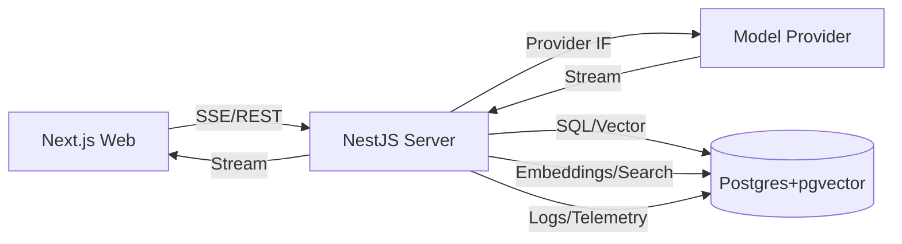
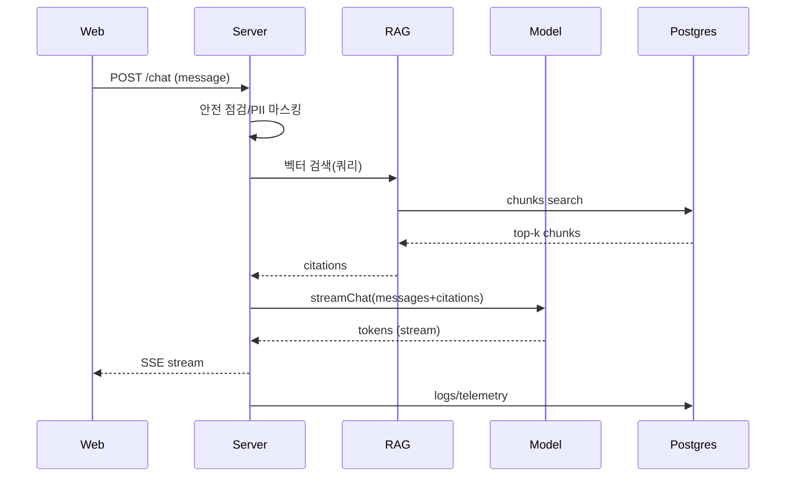

# 아키텍처: woo-chatbot

## 1) 전체 구조
- Web(Next.js 15) → API(NestJS) → Model Provider(OpenAI/Anthropic/Ollama/vLLM) → RAG(pgvector) → Postgres
- 이벤트 스트리밍: SSE 기반. 서버는 청크 단위로 토큰 전달, 클라이언트는 점진 렌더.
- 공용 패키지: `packages/shared`에서 타입/인터페이스, `packages/db`에서 Drizzle 스키마 제공.

## 2) ModelProvider 스위치 전략
- `packages/shared/model.ts`에서 `ModelProvider` 인터페이스 정의: `streamChat(messages, options) => AsyncIterable<Chunk>`
- 구현체: `OpenAIProvider`, `AnthropicProvider`, `OllamaProvider`, `VLLMProvider`를 서버에서 DI로 주입.
- 설정: `.env`의 `MODEL_PROVIDER=openai|anthropic|ollama|vllm`, `MODEL_NAME`, `API_KEY`.
- 오류 처리: 타임아웃/재시도, 레이트리밋 백오프, 공급자별 에러 정규화.

## 3) RAG 설계
- 파이프라인: 업로드 → 추출(PDF/Text) → 청크(토큰/문단) → 임베딩 → 벡터업서트 → 검색(Top-k, MMR) → 프롬프트 합성 → 모델 호출.
- 메타데이터: 문서ID/청크ID/페이지/섹션, 인덱스 `idx_doc_chunk`, GIST 인덱스로 벡터 검색.
- 캐시: 쿼리→결과 요약 캐시(선택), 임베딩 재사용(해시 키), 프롬프트 템플릿 버전.

## 4) 안전가드
- 미들웨어: 입력 사전 점검(정치/위험/자문/PII), 차단/경고/마스킹, 위반 로그 기록.
- 응답 후처리: 모델 출력에 대한 PII 재마스킹, 출처 미포함 시 경고 배지.
- 시스템 프롬프트: 역할/스타일/금지 주제/출처 표시/안전 안내 포함.

## 5) DevOps
- Docker: `docker-compose.yml`로 Postgres(벡터 확장) + Adminer.
- 배포: Web(Vercel), Server(Render/AWS ECS/Fargate), DB(Neon/RDS). 환경 변수는 플랫폼 시크릿으로 관리.
- 관측성: 요청 로깅, 트레이싱 헤더, 지표 내보내기(Prometheus 호환), 비용 추적.

## 6) 비용·성능·품질 트레이드오프
- OpenAI: 품질 높음/비용 중간/지연 낮음. Anthropic: 긴 문맥 강점. Ollama/vLLM: 비용 낮음/관리 복잡.
- 검색 Top-k를 4~16로 조절, 답변 길이는 200~1200 토큰 범위로 제한. MMR로 다양성 확보.
- SSE로 체감 반응성 향상, 임베딩/요약 캐시로 비용 절감.

## 7) 시퀀스(질의 처리)

