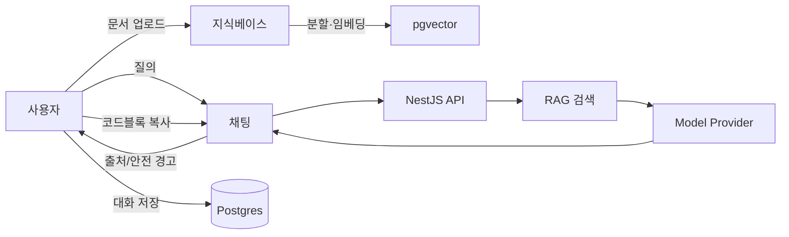

# 정보구조(IA): woo-chatbot

## 1) 주요 페이지 구조
- 홈(Home)
  - 제품 소개, 데모 진입, 최근 릴리즈 노트 링크
  - CTA: "지식베이스 업로드" / "채팅 시작"
- 채팅(Chat)
  - 좌측: 대화 리스트(검색/필터), 새 대화 버튼
  - 중앙: 메시지 스트림(스트리밍, 코드블록 복사, 출처 배지)
  - 우측: 컨텍스트 패널(선택된 문서/스니펫, 안전 경고, 프롬프트 힌트)
- 지식베이스(Knowledge Base)
  - 문서 업로드(Drag & Drop), 처리 상태(대기/분할/임베딩/완료)
  - 문서 리스트(이름, 태그, 업로드자, 크기), 상세(청크 미리보기)
- 설정(Settings)
  - 모델 제공자 선택(OpenAI/Anthropic/Ollama/vLLM), Max Tokens, Temperature
  - 안전 정책 옵션(정치 차단, 위험 차단 강도, PII 마스킹 수준)
  - 개인정보/저장 정책(로깅 수준, 보존 기간)
- 로그/리포트(Logs/Reports)
  - 대화/메시지 로그, 규제위반(violations), 텔레메트리 이벤트
  - 비용/성능 대시보드

## 2) 사용자 플로우
- 업로드 → 질의 → 응답 → 복사/저장

## 3) 화면 인터랙션 규칙
- 입력창
  - Enter: 전송, Shift+Enter: 줄바꿈, Cmd+K: 지식베이스 검색 삽입
  - Cmd+/: 시스템 프롬프트 미리보기, Cmd+R: 마지막 응답 재생성
- 메시지 아이템
  - Hover 시 액션: 복사, 소스 보기, 북마크, 재생성
  - 코드블록: 언어 감지, "복사" 버튼, 줄 번호 토글
  - 출처: 문서명/페이지/청크ID 배지, 클릭 시 우측 패널 하이라이트
- 스트리밍
  - SSE로 토큰 단위 렌더, 안전 경고 발생 시 상단 배너 표시
  - 중단/취소 버튼, 재시도 버튼

## 4) 접근성/국제화
- 키보드 내비게이션(탭 순서, 스킵 링크), 명도 대비, 스크린리더 레이블
- 언어: 한국어 기본, 영어 준비(문자열 분리)

## 5) 정보 설계 원칙
- 신뢰성 우선: 출처를 항상 가시화, 안전 경고는 눈에 띄게
- 단순성: 3패널 레이아웃(대화 리스트/대화/컨텍스트)로 일관성 유지
- 성능: 지연 최소화를 위해 가상 리스트와 토큰 단위 렌더 최적화
